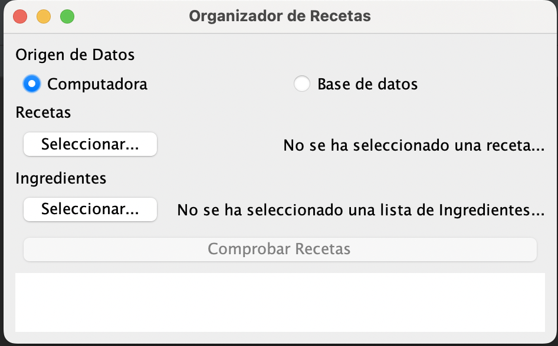

# organizador-recetas

Este proyecto forma parte del TP1 de Programación avanzada 1 de la EFC de la UNLaM.

## Enunciado

Desarrollar un programa que, mediante un listado de recetas de cocina, y un listado de
ingredientes disponibles para cocinar, determine todas las recetas que se pueden
hacer con los ingredientes ingresados.
- El listado de recetas disponibles debe leerse de un archivo de texto
- El listado de ingredientes disponibles debe leerse de un archivo de texto
- El programa debe implementarse con una interfaz gráfica que permita
seleccionar los archivos de texto de recetas y de ingredientes (la ruta a los
archivos no puede estar seteada en el código)
- Se deben implementar como mínimo las siguientes clases (pueden tener
distintos nombres, pero el comportamiento debe ser similar)

  - **Main / Interfaz**: clase principal del programa, desde aquí debe llamarse
  a las funcionalidades de las otras clases
  - **Receta**: nombre de la receta y una lista de ingredientes
  - **Ingrediente**: nombre, código (si es necesario para simplificar las
  búsquedas o comparaciones), cantidad
  - **OrganizadorRecetas**: clase que se encarga de determinar si una receta
  puede hacerse en base a los ingredientes disponibles. Esta se comunica
  con la clase main.
  - **ServicioRecetas**: clase que lee los archivos de texto y los convierte a
  objetos de Java. La clase OrganizadorRecetas debe utilizar esta clase
  para obtener el listado de recetas o de ingredientes, no pueden leerse
  los archivos dentro de la misma clase OrganizadorRecetas.

---
2022.